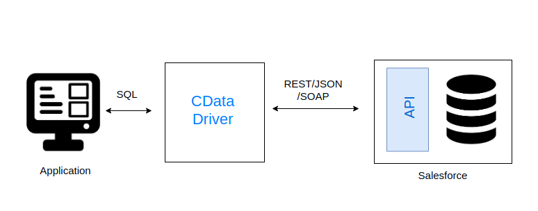

# Sample Ballerina Program That Uses CData JDBC Driver for Salesforce

CData provides drivers for different APIs and systems using SQL as the foundation.



CData JDBC Driver for Salesforce provide a way to connect to Salesforce data as traditional way connecting database and manipulating data. By running simple SQL queries needed results from Salesforce are obtained from your Ballerina program.

#### Compatibility

| Ballerina Language Versions  |
|:----------------------------:|
|      Swan Lake Preview 5      |

The following sections provide you with information on how to use the CData JDBC Driver for Salesforce.
- [Establishing a Connection ](#Establishing-a-Connection )
- [Executing Statements](#Executing-Statements)


### Establishing a Connection 
#### Make Connection using CData driver

First we have to get CData JDBC Driver (.jar) for Salesforce.

Then in ballerina project we have to specify the driver in Ballerina.toml file.
    
    [dependencies]
    [platform] 
    target = "<java version>" 

        [[platform.libraries]] 
        path = "<path to cdata jdbc driver>" 
        modules = ["<name of module>"]
    
Import needed libraries.
```ballerina
import ballerina/io;
import ballerina/java.jdbc;
import ballerina/sql;
import ballerina/config;
```
Then we have to initialize the jdbc client using a connection string by providing necessary configuration information in a ballerina.conf file. Security token can be obtained from Salesforce account by signing into it.

```ballerina    
jdbc:Client cdataSalesforceDB = check new (
    "jdbc:salesforce:User="+config:getAsString("USERNAME") + ";Password=" + config:getAsString("PASSWORD") + ";Security Token=" + config:getAsString("TOKEN")
);
```
### Executing Statements
After creating connection using connection string, you can execute SQL statements to manipulate data records in Salesforce.

#### SELECT Statement
By using the jdbc client object call remote method `query` which returns stream of records. Then information is obtained from returned stream of records.
```ballerina           
sql:ParameterizedQuery selectQuery = `SELECT Id, Name, AccountNumber, Industry, Description 
                                       FROM Account WHERE Id IS NOT NULL`;
stream<record{}, sql:Error> resultStream = cdataSalesforceDB->query(selectQuery,SalesforceAccount);

stream<SalesforceAccount, sql:Error> accountResultStream = <stream<SalesforceAccount, sql:Error>> resultStream;
        
error? e = accountResultStream.forEach(function(SalesforceAccount result) {
    io:println("Account details: ", result);
});

if (e is error) {
    io:println("Fetching data in stream by foreach failed!");
    io:println(e);
}

e = resultStream.close();
```
#### INSERT Statement
To perform an insert operation of a record, call remote method `execute` and provide the relevant query to perform.
```ballerina
SalesforceAccount sampleAccount = {
    id: "ACC_000000",
    name: "Test Account", 
    accType: "Customer - Direct", 
    accountNumber: "CD355119-TEST",
    industry: "Energy", 
    description: "Test account desc."
};

sql:ParameterizedQuery insertQuery= `INSERT INTO Account (Name, Type, AccountNumber, Industry, Description) 
                                     VALUES (${sampleAccount.name},${sampleAccount?.accType ?: ""},${sampleAccount?.accountNumber ?: ""},
                                     ${sampleAccount?.industry ?: ""},${sampleAccount?.description ?: ""})`;
sql:ExecutionResult|sql:Error result = cdataSalesforceDB->execute(insertQuery);
if (result is sql:ExecutionResult) {
    io:println(result);
    sampleAccount.id=<string>result.lastInsertId;
}else{
    io:println("Insert failed: ", <string>result.message());
}
```
#### UPDATE Statement
To perform an update operation on a record, call remote method `execute` and provide the relevant query to perform
```ballerina
sql:ParameterizedQuery updateQuery = `UPDATE Account SET name = ${"Updated Account"} WHERE id = ${sampleAccount.id}`;
result = cdataSalesforceDB->execute(updateQuery);
if (result is sql:ExecutionResult) {
    io:println(result.toString());
} else {
    io:println("Update data from Salesforce Accounts table has failed: ",<string>result.message());
}
```       
#### DELETE Statement
To perform an delete operation on a record, call remote method `execute` and provide the relevant query to perform
```ballerina
sql:ParameterizedQuery deleteQuery = `DELETE FROM Account WHERE id = ${sampleAccount.id}`;
result = cdataSalesforceDB->execute(deleteQuery);
if (result is sql:ExecutionResult) {
    io:println(result.toString());
} else {
    io:println("Delete data from Salesforce Accounts table has failed: ",<string>result.message());
}
```
#### Batch Processing
To perform an batch operations, call remote method `batchExecute` and provide the relevant query to perform, CData JDBC Driver for Salesforce provide support for bulk operations in Salesforce. Batch processing can be performed by executing a batch of DDL/DML operations. Below is one example Batch Insertion operation.
##### Batch Insert
```ballerina
SalesforceAccount sampleAccount1 = {
    id: "ACC_000001",
    name: "Test Account-Batch1", 
    accType: "Customer - Direct", 
    accountNumber: "CD355119-TEST",
    industry: "Energy", 
    description: "Test account desc."
};
SalesforceAccount sampleAccount2 = {
    id: "ACC_000002",
    name: "Test Account-Batch2", 
    accType: "Customer - Direct", 
    accountNumber: "CD355119-TEST",
    industry: "Energy", 
    description: "Test account desc."
};
SalesforceAccount sampleAccount3 = {
    id: "ACC_000003",
    name: "Test Account-Batch3", 
    accType: "Customer - Direct", 
    accountNumber: "CD355119-TEST",
    industry: "Energy", 
    description: "Test account desc."
};

var insertRecords = [sampleAccount1, sampleAccount2, sampleAccount3];

sql:ParameterizedQuery[] insertQueries =
from var data in insertRecords
    select  `INSERT INTO Account
        (Name, Type, AccountNumber, Industry, Description)
        VALUES (${data.name}, ${data?.accType},
        ${data?.accountNumber}, ${data?.industry}, ${data?.description})`;

sql:ExecutionResult[]|sql:Error batchResults = cdataSalesforceDB->batchExecute(insertQueries);
string[] idRecords=[];

if (batchResults is sql:ExecutionResult[]) {
    io:println("Insert success");
    foreach var batchResult in batchResults {
        idRecords.push(<string>batchResult.lastInsertId)
        io:println("Generated ID: ", batchResult.lastInsertId);
    }
} else {
    io:println("Error occurred while batch execution: ", result);
}
```

##### Batch Update
```ballerina
sql:ParameterizedQuery[] updateQueries =
from var data in idRecords
    select `UPDATE Account SET name = ${"Batch Updated Account"} WHERE id = ${data}`;

batchResults = cdataSalesforceDB->batchExecute(updateQueries);

if (batchResults is sql:ExecutionResult[]) {
    io:println("Batch update success");
    foreach var batchResult in batchResults {
        io:println("Updated ID: ", batchResult.lastInsertId);
    }
} else {
    io:println("Error occurred while batch update execution: ", result);
}
```

##### Batch Delete
```ballerina
sql:ParameterizedQuery[] deleteQueries =
from var data in idRecords
    select `DELETE FROM Account WHERE id = ${data}`;

batchResults = cdataSalesforceDB->batchExecute(deleteQueries);

if (batchResults is sql:ExecutionResult[]) {
    io:println("Batch delete success");
    foreach var batchResult in batchResults {
        io:println("Deleted ID: ", batchResult.lastInsertId);
    }
} else {
    io:println("Error occurred while batch delete execution: ", result);
}
```
        
#### Stored Procedures
To execute Stored procedures available we have to use remote method `call` and provide the relevant procedure to perform, for example here `GetUserInformation` is the procedure being called. Stored procedures may take a list of parameters and return data that constitute the response.
```ballerina
sql:ProcedureCallResult|sql:Error retCall = 
                        cdataSalesforceDB->call("{CALL GetUserInformation()}");

if (retCall is sql:ProcedureCallResult) {
    io:println("Calling stored procedure");
    stream<record{}, sql:Error>? resultStoredProcedure = retCall.queryResult;
    if (!(resultStoredProcedure is ())) {
        stream<record{}, sql:Error> userStream = 
                                <stream<record{}, sql:Error>> resultStoredProcedure;
        e = userStream.forEach(function(record{} user) {
                            io:println("User details: ", user.toJson());
                    });
    } else {
        io:println("Empty result is returned from the `GetUserInformation`.");
    }

} else {
   io:println("Error occurred while invoking `GetUserInformation`.");
}
```
